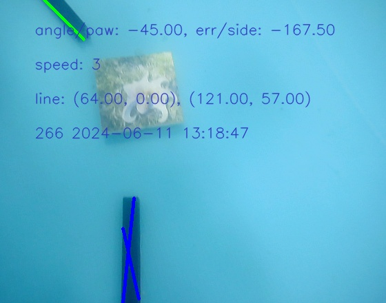
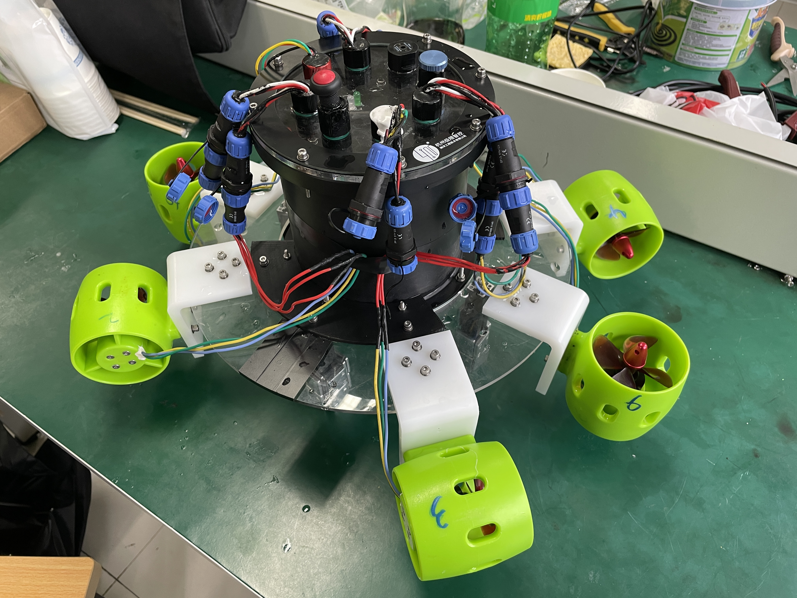
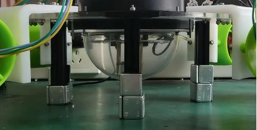

# underwater robot vision module

本项目用于2024年春夏学期，机器人课程 - 浙江大学水下机器人竞赛。竞赛章程见附件[浙江大学第八届水下机器人竞赛规则.pdf](documents/浙江大学第八届水下机器人竞赛规则.pdf)。

> 本项目由 超级霸王龙战队 共同搭建，我们的成员包括曾永明(3210101442@zju.edu.cn)、封嘉仪(jiayii@zju.edu.cn)、郭明皓(zjugmh@zju.edu.cn)、吴恒(3210103458@zju.edu.cn)。
> 如果对我们的设计感兴趣，欢迎与我们联系：
>   - 硬件设计与组装：吴恒，封嘉仪，曾永明
>   - 树莓派视觉与STM32电控：郭明皓，曾永明
>   - 海洋生物声音识别：封嘉仪

本项目主题功能：巡线、纯色卡片识别，海洋生物图片卡片识别。

巡线可视化效果



机器人实拍图



摄像头位置说明图



## 树莓派与STM32通信协议

1. 开始标志 (0xFE): 消息的起始字节，用来标识一帧新消息的开始。
2. Cam_Sign (1 Byte):
    - 功能: 表示AUV的当前状态。
    - 编码: 0表示巡线状态（正常运动），1表示识别状态（需停止并LED闪烁，通过LoRa回传信息），2用于控制电机停转，3用于传输debug数据，4用于传输摄像头状态。
    - 当`Cam_Sign==0`即在巡线状态下，`Cam_Flag`，`Cam_Angle`和`Cam_Err`分别传输当前电机需要的速度，转向角度和横移量。
3. Cam_Flag (1 Byte):
    - 功能: 当`Cam_Sign==1`即在识别状态下，表示识别到的特定标志。
    - 编码:
        1. 纯绿色
        2. 纯蓝色
        3. 海洋动物-章鱼
        4. 海洋动物-鲨鱼
        5. 海洋动物-海龟
4. Cam_Angle (2 Bytes):
    - 功能: 表示机体坐标系中摄像头的角度。
    - 编码: 将实际角度(-180°至180°)转换为16位有符号整数，范围从-32768至32767，对应-180°至180°。
5. Cam_Err (2 Bytes):
    - 功能: 可能表示导线距离图片中心的大小或其它误差信息。
    - 编码: 类似于Cam_Angle，将实际测量值转换为16位有符号整数表示。
6. 累加和校验 (2 Bytes):
    - 功能: 用于确保数据完整性。
    - 计算方式: 将消息体中除开始和结束标志外的所有字节相加得到的和，转换为16位无符号整数。
7. 结束标志 (0xFF): 消息的结束字节，用来标识消息的结束。

协议总长度: 10 字节。用于通过LoRa等无线通信技术，在水下机器人的巡线和识别任务中，传输关键状态和传感器数据。用于确保信息的紧凑性，在一定程度上拥有错误检测能力。

## 使用说明

### 准备代码

```shell
git clone https://gitee.com/henryoasis/underwater_robot.git
```

### 准备识别相关文件

在项目根目录创建文件夹并命名为`file`。

将海洋生物图像放在`all_figure_wo_color`文件夹下，每张卡片以`{class}{index}.png`命名，如`octopus1.png`。

参考`utils/img.py`中的`get_res`函数，将`*.h5`文件保存在`des_dataset`下，用于识别海洋生物。（空间换时间）

### 主程序

绝大部分超参数在`main.py`中`if __name__ == "__main__"`处定义，如直线识别中的颜色范围，输入输出路径，转角偏置等。

```shell
pkill -f python # make sure camera can be used in the following python process
python main.py
```

### 停止电机运转

```shell
source stop_motor.sh # stop motor to save energy when coding in raspberry pi
```

### 串口通信

用于快速发送指令给STM32，debug时使用。

```shell
python com.py -s 0 -f 0 -a 0 -e 0 # send message to STM32
```

### 标志位重置

用于每次开始新的巡线任务时，重置标志位。他会重置`flag.json`文件内容

```shell
python init_flag.py
```

### 稳定运行

参考以下脚本，稳定运行程序。

```shell
python init_flag.py
pkill -f python

max=100
for i in `seq 1 $max`
do
    echo "Run - $i"
    python main.py
done
```

## 代码设计

我们使用树莓派4B作为主控，外置摄像头作为视觉模块，通过GPIO串口向STM32发送指令，从而控制电机运行。

`main.py`为程序主函数，用于机器人视觉导航控制的主程序，它通过摄像头捕获图像，识别场景中的线条和颜色，根据识别结果计算出控制指令（如速度、转向角度），然后通过串口发送给机器人，实现自主导航。同时，它还涉及到特征点匹配、错误处理和性能监控等功能。

文件夹`utils`下的函数文件为`main.py`中调用的子模块的实现。其中各文件的功能如下：
- `denote.py`：记录运行时程序状态信息，采集图像并标注信息，保存图像，程序性能分析等；
- `gpio.py`：GPIO串口通信，通过向STM32发送指令控制电机运行；
- `img.py`：进行图像识别，纯色卡片识别，海洋生物图片卡片识别等；
- `iojson.py`：读取配置文件，保存配置文件（目前代码仍存放在`main.py`中，暂未迁移至该文件）；
- `line.py`：路线识别，路线筛选，最优路线选择，及相关函数（核心代码文件）；
- `motion.py`：控制电机参数（校赛时未使用）。

## TO DO LIST

- [ ] 补充教程（如果有需要）
